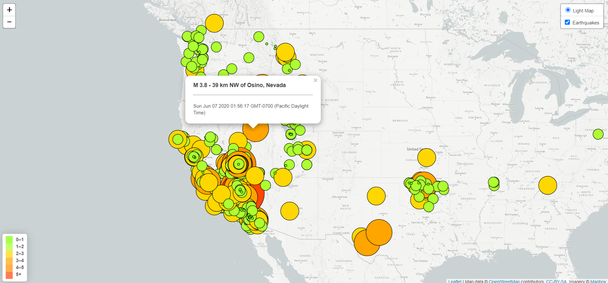
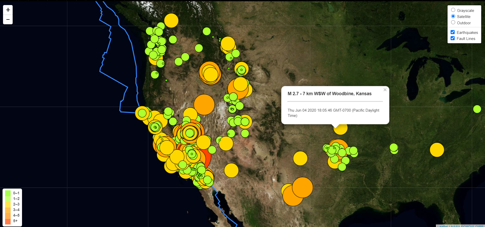
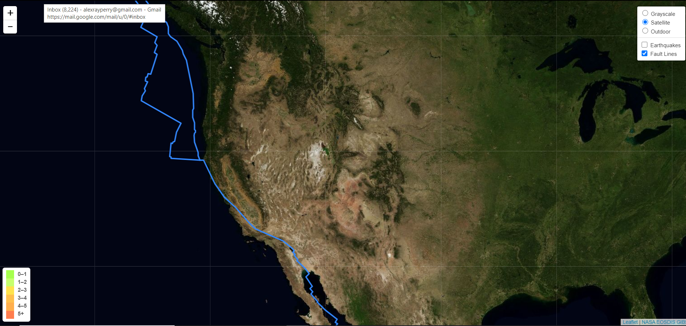
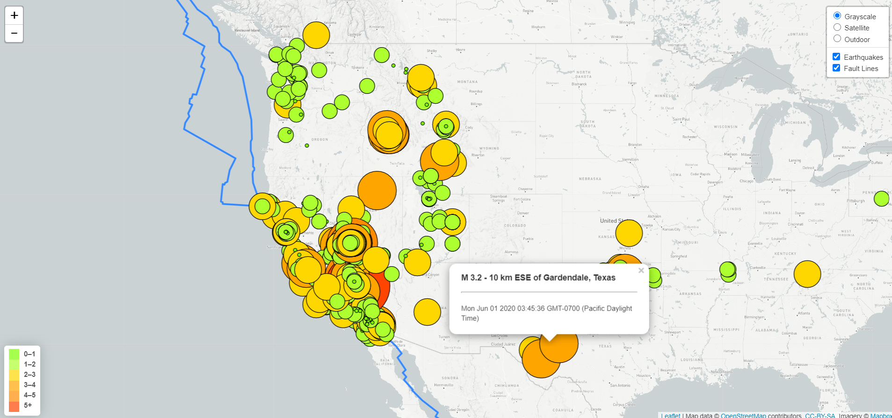
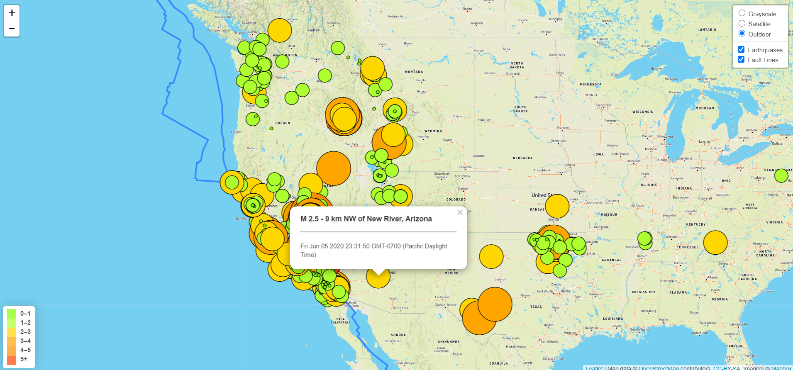

# Visualizing USGS Data with Leaflet

## Background

The United States Geological Survey ("USGS") is responsible for providing scientific data about natural hazards, the health of our ecosystems and environment; and the impacts of climate and land-use change. In this project, I utilize javascript, d3, and leaflet to connect to the USGS's API to retreive geoJSON data and visualize the data, providing the user with a functional webpage that is user-drive. 

### Level 1: Basic Visualization

Using leaflet I have created a grayscale map that plots all of the earthquakes recorded with the USGS in the last week. The data markers refelct the magnitude of the earthquake in their size and color. Earthquakes with higher magnitude are larger and darker in color. Each marker can be clicked on which will initiae a popup that provides additional information about the earthquake. 

### Level 2: More Data & Additional Layer

A more advanced map will plot a second data set from a different source to add more meaningful information to the existing visualization. In this second part of my project, I have used a geoJSON file, containing the coordintates to the earth's fault lines, and added that data to the visualization as faultline drawn on the map. In addition, I added a control panel that can toggle both data layers on and off. The control layer can also toggle between different tile layers that I have included in the maps functionality.  

## Source Data
* [USGS GeoJSON Feed](http://earthquake.usgs.gov/earthquakes/feed/v1.0/geojson.php)
* <https://github.com/fraxen/tectonicplates>